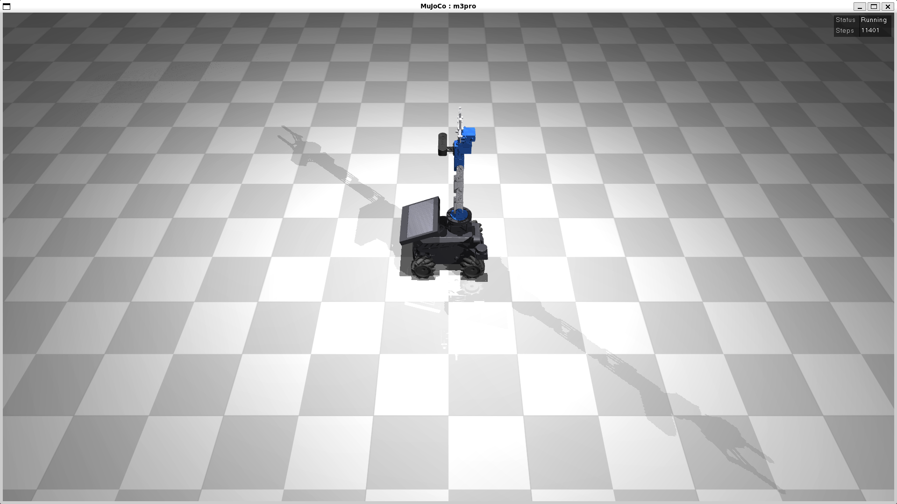
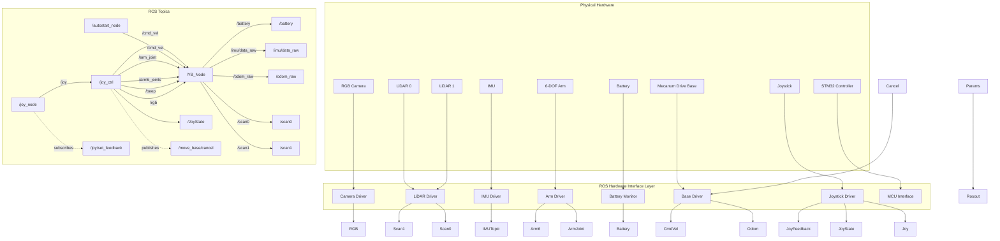

# Yahboom ROSMASTER M3 Pro MuJoCo Simulation 

MuJoCo physics simulation of the [Yahboom ROSMASTER M3 Pro](https://category.yahboom.net/products/rosmaster-m3-pro) robot with ROS2 Humble integration via `ros2_control`. The simulation publishes sensor data and accepts velocity commands on standard ROS topics, enabling development of navigation, perception, and control algorithms without the physical robot.



## Robot Features Simulated

- **Mecanum drive base** — 4 mecanum wheels with anisotropic friction, omnidirectional motion
- **6-DOF robotic arm** — Position-controlled with gripper (mimic-joint coupled fingers)
- **Depth camera** — RGB + depth image streams
- **Dual LiDAR** — Front-left and rear-right TOF rangefinder arrays (T-mini Plus, 0.05–12m range)
- **9-axis IMU** — Orientation, angular velocity, linear acceleration
- **Wheel encoders** — Joint position and velocity feedback

## Repository Structure

```
src/
├── m3pro_description/       # Robot model package
│   ├── mjcf/m3pro.xml       # MuJoCo model (primary simulation model)
│   ├── urdf/                # Plain URDF for robot_state_publisher & ros2_control
│   ├── meshes/              # STL mesh files from Yahboom CAD
│   ├── rviz/                # RViz display config
│   └── launch/              # display.launch.py (RViz-only visualization)
│
└── m3pro_mujoco_sim/        # Simulation launch & config package
    ├── config/
    │   ├── controllers.yaml       # ros2_control controller definitions
    │   └── mujoco_plugins.yaml    # Camera & LiDAR sensor plugin config
    ├── launch/
    │   ├── sim.launch.py          # Headless simulation
    │   └── sim_with_rviz.launch.py
    └── worlds/                    # Scene files with obstacles
```

## ROS Topics

### Control Inputs

| Topic | Type | Description |
|-------|------|-------------|
| `/mecanum_drive_controller/reference_unstamped` | `geometry_msgs/Twist` | Base velocity (vx, vy, omega) |
| `/arm_controller/joint_trajectory` | `trajectory_msgs/JointTrajectory` | Arm trajectory commands |
| `/gripper_controller/commands` | `std_msgs/Float64MultiArray` | Gripper position |

### Sensor Outputs

| Topic | Type | Description |
|-------|------|-------------|
| `/joint_states` | `sensor_msgs/JointState` | All joint positions and velocities |
| `/mecanum_drive_controller/odom` | `nav_msgs/Odometry` | Wheel odometry |
| `/imu/data` | `sensor_msgs/Imu` | IMU data (via MuJoCo sensor plugin) |
| `/depth_camera/color/image_raw` | `sensor_msgs/Image` | RGB camera image |
| `/depth_camera/depth/image_raw` | `sensor_msgs/Image` | Depth image |
| `/lidar_front/scan` | `sensor_msgs/LaserScan` | Front LiDAR scan |
| `/lidar_rear/scan` | `sensor_msgs/LaserScan` | Rear LiDAR scan |

## Quick Start (Dev Container)

The easiest way to get started on any OS — all dependencies are pre-installed:

1. Install [Docker](https://docs.docker.com/get-docker/) and [VS Code](https://code.visualstudio.com/) with the [Dev Containers extension](https://marketplace.visualstudio.com/items?itemName=ms-vscode-remote.remote-containers)
2. Clone this repo and open it in VS Code
3. When prompted, click **"Reopen in Container"** (or run `Dev Containers: Reopen in Container` from the command palette)
4. The container builds and installs all dependencies automatically. Once ready:

```bash
source install/setup.bash
ros2 launch m3pro_mujoco_sim sim.launch.py
```

> **GUI note:** For MuJoCo viewer and RViz, you need X11 forwarding. On Linux/WSL2 this works out of the box. On macOS, install [XQuartz](https://www.xquartz.org/) and run `xhost +local:docker` first.

## Manual Setup (Ubuntu 22.04)

### Prerequisites

- **Ubuntu 22.04** (native or WSL2)
- **ROS2 Humble** — [Installation guide](https://docs.ros.org/en/humble/Installation.html)

### 1. Install dependencies

```bash
sudo apt update
sudo apt install -y \
  ros-humble-mujoco-ros2-control \
  ros-humble-ros2-controllers \
  ros-humble-controller-manager \
  ros-humble-robot-state-publisher \
  ros-humble-joint-state-publisher-gui \
  ros-humble-rviz2 \
  ros-humble-teleop-twist-keyboard
pip install mujoco
```

### 2. Build

```bash
source /opt/ros/humble/setup.bash
colcon build --symlink-install --cmake-args -DCMAKE_BUILD_TYPE=Release
source install/setup.bash
```

## Run

### Launch simulation with MuJoCo viewer

```bash
ros2 launch m3pro_mujoco_sim sim.launch.py
```

### Launch simulation with RViz

```bash
ros2 launch m3pro_mujoco_sim sim_with_rviz.launch.py
```

### Drive the robot with keyboard teleop

In a separate terminal:

```bash
source install/setup.bash
ros2 run teleop_twist_keyboard teleop_twist_keyboard \
  --ros-args --remap cmd_vel:=/mecanum_drive_controller/reference_unstamped
```

To verify commands are actually reaching the controller, watch the topic in a third terminal while pressing keys:

```bash
ros2 topic echo /mecanum_drive_controller/reference_unstamped
```

#### Keyboard bindings

The mecanum base is holonomic, so it can strafe sideways as well as drive and turn. Hold **Shift** on the letter keys below to strafe instead of turning.

| Key | Motion | Shift+Key | Motion |
|-----|--------|-----------|--------|
| `i` | Forward | `I` | Forward |
| `,` | Backward | `<` | Backward |
| `j` | Turn left (CCW) | `J` | Strafe left |
| `l` | Turn right (CW) | `L` | Strafe right |
| `u` | Forward + turn left | `U` | Forward + strafe left |
| `o` | Forward + turn right | `O` | Forward + strafe right |
| `m` | Backward + turn right | `M` | Backward + strafe left |
| `.` | Backward + turn left | `>` | Backward + strafe right |
| `t` | Up (+z, unused on ground base) | | |
| `b` | Down (-z, unused on ground base) | | |
| any other key | Stop | | |

Speed adjustment:

| Key | Effect |
|-----|--------|
| `q` / `z` | Increase / decrease both linear and angular speed by 10% |
| `w` / `x` | Increase / decrease linear speed only by 10% |
| `e` / `c` | Increase / decrease angular speed only by 10% |

Default speed is 0.5 m/s linear, 1.0 rad/s angular. `Ctrl-C` quits and publishes a zero-velocity command on exit.

### View URDF in RViz (no simulation)

```bash
ros2 launch m3pro_description display.launch.py
```

## Architecture

The simulation uses `ros-controls/mujoco_ros2_control` as the bridge between MuJoCo and ROS2:

```
┌─────────────────────────────────────────────┐
│  MuJoCo Physics Engine                      │
│  (m3pro.xml — MJCF model)                   │
└──────────────┬──────────────────────────────┘
               │ MujocoSystemInterface
┌──────────────┴──────────────────────────────┐
│  ros2_control Controller Manager            │
│  ├── mecanum_drive_controller               │
│  ├── joint_state_broadcaster                │
│  ├── arm_controller (JointTrajectory)       │
│  └── gripper_controller                     │
└──────────────┬──────────────────────────────┘
               │ ROS2 Topics
┌──────────────┴──────────────────────────────┐
│  Your Application                           │
│  (nav2, MoveIt2, custom nodes, etc.)        │
└─────────────────────────────────────────────┘
```

## ROSMASTER M3 Pro Hardware Interface


| ROS Node | Description | Responsibility |
|----------|-------------|----------------|
| **`/YB_Node`** | Yahboom Hardware Interface Node | Primary interface between ROS 2 and the ROSMASTER hardware. Receives commands for the mobile base, robotic arm, buzzer, and RGB LED, and publishes hardware telemetry including LiDAR, IMU, odometry, and battery status. |
| **`/autostart_node`** | Autostart Node | Initializes the robot during startup and publishes initialization commands (including `/cmd_vel`) required during system bring-up. |
| **`/joy_node`** | Joystick Driver Node | Standard ROS 2 joystick driver. Reads the physical game controller and publishes `sensor_msgs/msg/Joy` messages. Accepts haptic feedback through `/joy/set_feedback`. |
| **`/joy_ctrl`** | Joystick Control Node | Converts joystick input into robot control commands. Publishes velocity commands (`/cmd_vel`), arm commands (`/arm_joint`, `/arm6_joints`), RGB LED commands (`/rgb`), buzzer commands (`/beep`), and joystick state (`/JoyState`). |



| Topic               | Message Type                        | Purpose                               |
| ------------------- | ----------------------------------- | ------------------------------------- |
| `/cmd_vel`          | `geometry_msgs/msg/Twist`           | Velocity commands to the mecanum base |
| `/odom_raw`         | `nav_msgs/msg/Odometry`             | Raw wheel odometry                    |
| `/imu/data_raw`     | `sensor_msgs/msg/Imu`               | IMU measurements                      |
| `/scan0`            | `sensor_msgs/msg/LaserScan`         | Primary LiDAR scan                    |
| `/scan1`            | `sensor_msgs/msg/LaserScan`         | Secondary LiDAR scan                  |
| `/arm_joint`        | `arm_msgs/msg/ArmJoint`             | Individual arm joint command          |
| `/arm6_joints`      | `arm_msgs/msg/ArmJoints`            | Six-joint arm state/command           |
| `/battery`          | `std_msgs/msg/Float32`              | Battery voltage or charge level       |
| `/joy`              | `sensor_msgs/msg/Joy`               | Joystick input                        |
| `/JoyState`         | `std_msgs/msg/Bool`                 | Joystick enable/status                |
| `/joy/set_feedback` | `sensor_msgs/msg/JoyFeedback`       | Controller vibration/feedback         |
| `/beep`             | `std_msgs/msg/UInt16`               | Buzzer command                        |
| `/rgb`              | `std_msgs/msg/ColorRGBA`            | RGB LED control                       |
| `/move_base/cancel` | `actionlib_msgs/msg/GoalID`         | Cancel navigation goal                |
| `/parameter_events` | `rcl_interfaces/msg/ParameterEvent` | ROS 2 parameter updates               |
| `/rosout`           | `rcl_interfaces/msg/Log`            | ROS logging                           |
